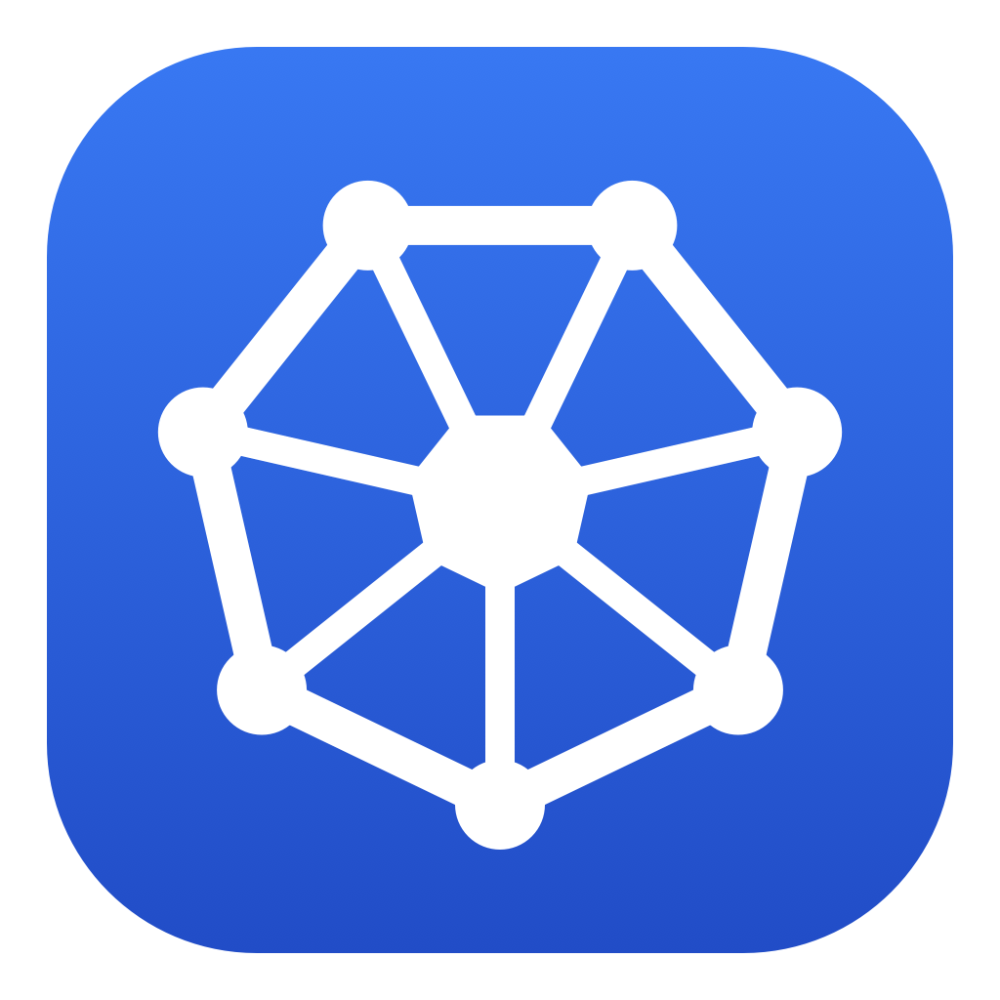

<div align="center">


# Kates

</div>

A native macOS UI for Kubernetes. Browse any resource your cluster exposes, watch live metrics and logs, and act on workloads — all from a fast SwiftUI app that talks to the Kubernetes API directly, with no `kubectl` shell-outs and no web runtime.

## What it does

- **Dynamic resource discovery** — the sidebar is built from the cluster's own API discovery (`/api`, `/apis/*`), so *every* type shows up, grouped by API group — core resources, `apps`, CRDs' custom resources, everything
- **Live tables** — auto-refresh on a tunable interval (Off / 1s / 2s / 5s / 10s), every column sortable, with a full-width table that splits to reveal details when you open a resource
- **Top (metrics)** — CPU and memory for pods and nodes via `metrics.k8s.io`, plus **% of requests and % of limits** per pod (over-limit highlighted)
- **Live logs** — selecting a pod opens an embedded log pane that tails the last lines and follows automatically, with a follow toggle, full-log fetch, container picker, and copy
- **YAML viewer** — kubectl-style YAML for the selected object, with one-click copy
- **Events** — rendered like `kubectl events`: Last Seen · Type · Reason · Object · Message, newest first
- **Actions** — delete pods, scale deployments, inspect a pod's containers and a node's running pods
- **Multi-context & all-namespaces** — switch kube contexts and namespaces from the toolbar, or view across all namespaces at once
- **Native mTLS** — client-certificate auth and custom CA handled directly from your kubeconfig (no keychain round-trip)

## Requirements

- macOS 14.4 or later
- Swift 6 toolchain (Xcode 16 or later)
- A reachable cluster and a kubeconfig (selected in-app via **Open Kubeconfig…**)

## Building

```bash
# Build and assemble a double-clickable Kates.app (release)
./scripts/bundle.sh

# …or for fast iteration during development
swift run
```

`scripts/bundle.sh` compiles, renders the app icon, builds `AppIcon.icns`, and assembles `Kates.app` with its `Info.plist`. Pass `debug` (`./scripts/bundle.sh debug`) for a much faster, unoptimized bundle.

> [!NOTE]
> GUI apps launched from Finder/Dock don't inherit your shell's `$KUBECONFIG`. On first launch, use **Open Kubeconfig…** in the toolbar to pick your config; the choice is remembered across launches.

## Running tests

```bash
swift test
```

## Architecture

```
┌──────────────────────────────────────────────────────────────┐
│  Kates (SwiftUI app)                                           │
│   KatesApp · AppModel (@Observable)                            │
│   ├─ ContentView ── sidebar (discovered types) + toolbar       │
│   ├─ ResourceListView ── live, sortable Table  ┐ vertical      │
│   └─ DetailView ── YAML · containers · actions ┘ split         │
│        └─ LogPane (embedded, follows live)                     │
│                          │                                     │
│                          ▼                                     │
│  KubeKit (the only module that imports SwiftkubeClient)        │
│   ClusterService ── discovery · generic list · logs · metrics  │
│                     · scale · delete · per-context connection  │
│   ContextStore ── kubeconfig façade   Discovery ── GVR + types │
└──────────────────────────────────────────────────────────────┘
```

The whole SwiftkubeClient surface is wrapped behind `ClusterService`, so the rest of the app deals only in KubeKit types — swapping the client implementation touches one file.

Built on [SwiftkubeClient](https://github.com/swiftkube/client) + [SwiftkubeModel](https://github.com/swiftkube/model) (SwiftNIO / AsyncHTTPClient) and [Yams](https://github.com/jpsim/Yams). Pure Swift + SwiftUI — no Electron, no web runtime.

## Project layout

```
Sources/
├── KubeKit/      # Cluster boundary: ClusterService, ContextStore, Discovery,
│                 #   Display helpers, errors  (imports SwiftkubeClient/Model)
└── Kates/        # SwiftUI app: KatesApp, AppModel, ContentView,
                  #   ResourceListView, DetailView, LogsView (LogPane), FilePanel

Tests/            # KubeKit unit tests (display logic, kubeconfig parsing)
scripts/          # make_icon.swift (icon renderer), bundle.sh (.app assembly)
```

## License

MIT
